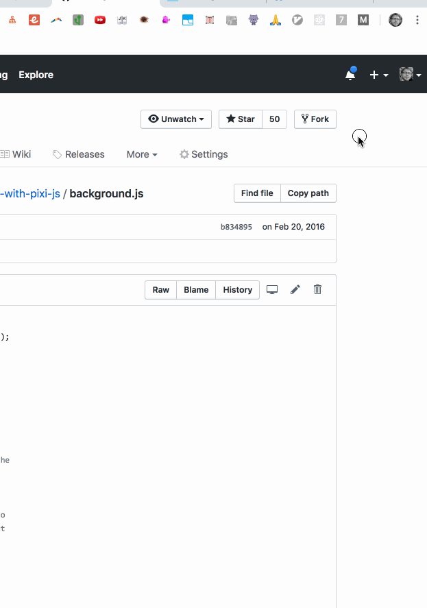

# Mouse Odometer Chrome Extension

# TODO

- Confirm physical distance
  - Test on devices with different DPI
- Don't get confused by jumps in clientX across frames
- show value in icon
- allow resetting
- live on-screen HUD?

## TODO done

- live updates in popup
  - cannot do this; the mousemove event doesn't fire when the popup is active
- change distance scale when tab Zoom is applied
